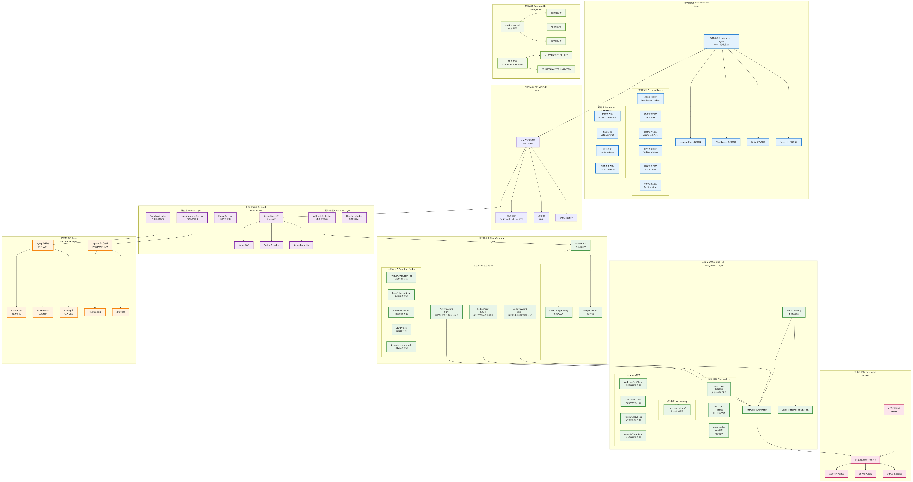

# 数学建模DeepResearch Agent

基于Spring AI Alibaba Graph框架和Vue.js的智能数学建模研究系统，集成Multi-Agents和Code Interpreter。


## 系统架构

### 后端技术栈
- **Spring Boot 3.2.0** - 主框架
- **Spring AI Alibaba 1.0.0.4** - AI Agent框架
- **MyBatis 3.0.3** - 数据访问层
- **MySQL 8.0** - 生产数据库
- **DashScope** - 阿里云大模型服务
- **Multi-LLMs** - 多模型配置
- **Code Interpreter** - 基于Jupyter的代码执行

### 前端技术栈
- **Vue 3.4.0** - 前端框架
- **Vue Router 4.2.0** - 路由管理
- **Pinia 2.1.0** - 状态管理
- **Element Plus 2.4.0** - UI组件库
- **ECharts 5.4.0** - 图表库
- **Axios 1.6.0** - HTTP客户端

## 核心功能

### 🔍 自动分析问题
- **建模手Agent**: 专业数学建模和问题分析
- **智能识别**: 问题类型、复杂度、变量定义
- **模型构建**: 目标函数、约束条件、求解策略

### 💻 Code Interpreter
- **Jupyter集成**: 基于Jupyter的代码执行环境
- **代码手Agent**: 自动生成Python求解代码
- **实时执行**: 代码执行、错误调试、结果验证
- **Notebook保存**: 代码保存为可编辑的notebook

### 📝 生成编排好格式的论文
- **论文手Agent**: 专业学术论文撰写
- **格式化输出**: LaTeX格式、学术规范
- **完整结构**: 摘要、引言、模型、求解、结论
- **多格式支持**: PDF、Word、Markdown

### 🤝 Multi-Agents系统
- **建模手**: 数学建模专家，使用qwen-max模型
- **代码手**: 代码工程师，使用qwen-plus模型  
- **论文手**: 学术写作专家，使用qwen-max模型
- **协同工作**: Graph工作流编排，并行执行

### 🔄 Multi-LLMs配置
- **专业分工**: 每个Agent使用最适合的模型
- **参数优化**: 不同任务使用不同的温度和token数
- **性能平衡**: 精确性、创造性、效率的平衡

## Graph工作流

系统采用Spring AI Alibaba的Graph框架，实现以下Multi-Agents工作流：

```
问题输入 → 建模手Agent → 代码手Agent → 论文手Agent → 完整输出
```

每个Agent都是独立的专业模块，可以并行执行和错误恢复。

## 快速开始

### 环境要求
- Java 17+
- Node.js 16+
- Maven 3.6+
- MySQL 8.0+

### 后端启动

1. 克隆项目
```bash
git clone <repository-url>
cd math-modeling-agent/backend
```

2. 配置环境变量
```bash
export AI_DASHSCOPE_API_KEY=your-api-key-here
export DB_USERNAME=root
export DB_PASSWORD=your-password
```

3. 启动应用
```bash
mvn spring-boot:run
```

### 前端启动

1. 进入前端目录
```bash
cd ../frontend
```

2. 安装依赖
```bash
npm install
```

3. 启动开发服务器
```bash
npm run dev
```

### 访问应用
- 前端界面: http://localhost:3000
- 后端API: http://localhost:8080/api

## API文档

### 深度研究API

#### 创建研究
```http
POST /api/research
Content-Type: application/json

{
  "title": "研究标题",
  "description": "研究描述",
  "type": "OPTIMIZATION",
  "problemStatement": "问题陈述",
  "researchGoals": "研究目标",
  "enabledAgents": ["modeling", "coding", "writing"],
  "modelConfig": "balanced",
  "enableCodeExecution": true
}
```

#### 执行研究
```http
POST /api/research/{researchId}/execute
```

#### 获取研究结果
```http
GET /api/research/{researchId}/results
```

#### 获取Notebook
```http
GET /api/research/{researchId}/notebook
```

## 部署指南

### 生产环境部署

1. **数据库配置**
   - 安装MySQL 8.0+
   - 创建数据库：`CREATE DATABASE math_agent;`
   - 执行初始化脚本：`mysql -u root -p math_agent < backend/src/main/resources/sql/schema.sql`

2. **后端部署**
   ```bash
   cd backend
   export AI_DASHSCOPE_API_KEY=your-api-key
   export DB_USERNAME=root
   export DB_PASSWORD=your-password
   mvn clean package -DskipTests
   java -jar target/math-modeling-agent-1.0.0.jar
   ```

3. **前端部署**
   ```bash
   cd frontend
   npm install
   npm run build
   # 将dist目录部署到Web服务器
   ```

4. **环境变量配置**
   - `AI_DASHSCOPE_API_KEY`: 阿里云DashScope API密钥
   - `DB_USERNAME`: 数据库用户名
   - `DB_PASSWORD`: 数据库密码

## 配置说明

### 环境变量
- `AI_DASHSCOPE_API_KEY`: 阿里云DashScope API密钥
- `DB_USERNAME`: MySQL用户名（默认：root）
- `DB_PASSWORD`: MySQL密码（默认：mathagent123）
- `DB_INIT_MODE`: 数据库初始化模式（默认：never）

### 数据库初始化
- **never**: 不自动初始化数据库（生产环境推荐）
- **always**: 每次启动都执行初始化（开发环境推荐）
- **embedded**: 仅在嵌入式数据库时初始化

### 配置文件
- `application-dev.yml`: 开发环境配置，自动初始化数据库
- `application-prod.yml`: 生产环境配置，不自动初始化数据库

### 后端配置 (application.yml)

```yaml
spring:
  ai:
    dashscope:
      api-key: ${AI_DASHSCOPE_API_KEY}
      chat:
        model: qwen-max
        temperature: 0.7
        max-tokens: 4000
      embedding:
        model: text-embedding-v3
      multimodal:
        model: qwen-vl-max

  # MyBatis配置
  mybatis:
    mapper-locations: classpath:mapper/*.xml
    type-aliases-package: com.mathagent.model
    configuration:
      map-underscore-to-camel-case: true
      log-impl: org.apache.ibatis.logging.stdout.StdOutImpl

logging:
  level:
    com.mathagent: DEBUG
```

### Multi-LLMs配置

```java
// 建模手专用模型
@Bean("modelingChatModel")
public DashScopeChatModel modelingChatModel() {
    return DashScopeChatModel.builder()
            .model("qwen-max")
            .temperature(0.3)  // 低温度确保准确性
            .maxTokens(4000)
            .build();
}

// 代码手专用模型
@Bean("codingChatModel")
public DashScopeChatModel codingChatModel() {
    return DashScopeChatModel.builder()
            .model("qwen-plus")
            .temperature(0.5)  // 中等温度平衡创造性和准确性
            .maxTokens(6000)
            .build();
}

// 论文手专用模型
@Bean("writingChatModel")
public DashScopeChatModel writingChatModel() {
    return DashScopeChatModel.builder()
            .model("qwen-max")
            .temperature(0.7)  // 较高温度增加创造性
            .maxTokens(8000)
            .build();
}
```

## 开发指南

### 添加新的Agent

1. 实现NodeAction接口
```java
@Component
public class CustomAgent implements NodeAction {
    @Autowired
    @Qualifier("customChatModel")
    private ChatClient customChatClient;
    
    @Override
    public OverAllState apply(OverAllState state) {
        // Agent逻辑
        return state;
    }
}
```

2. 在Graph配置中注册Agent
```java
.addNode("custom_agent", node_async(customAgent))
```

3. 定义Agent间的连接关系
```java
.addEdge("previous_agent", "custom_agent")
```

### 提示词管理

系统使用分文件管理所有Agent的提示词，按功能模块组织：

```
backend/src/main/resources/prompts/
├── modeling-agent-prompts.md    # 建模手Agent提示词
├── coding-agent-prompts.md      # 代码手Agent提示词
├── writing-agent-prompts.md     # 论文手Agent提示词
└── common-prompts.md           # 通用提示词
```

**文件结构示例**:
```markdown
# 建模手Agent提示词配置

## 问题分析提示词
作为专业的数学建模专家，请对以下问题进行深入分析：

问题描述：
{problemStatement}

请从以下维度进行专业建模分析：
...
```

**使用方式**:
```java
@Autowired
private PromptService promptService;

// 获取建模手提示词
String prompt = promptService.getModelingAnalysisPrompt(problemStatement);

// 获取代码手提示词
String prompt = promptService.getCodeGenerationPrompt(modelingResult);

// 获取论文手提示词
String prompt = promptService.getPaperGenerationPrompt(problem, modeling, coding);
```

**优势**:
- 按Agent分类管理，职责清晰
- 支持独立修改和版本控制
- 便于团队协作和维护
- 支持热更新和动态加载

## 系统特色

1. **专业分工**: Multi-Agents各司其职，专业高效
2. **智能协作**: Graph工作流编排，协同工作
3. **代码执行**: 基于Jupyter的实时代码执行环境
4. **论文生成**: 自动生成格式化的学术论文
5. **多模型优化**: 不同任务使用最适合的模型
6. **现代化界面**: 参考Google DeepResearch的UI设计

## 贡献指南

1. Fork项目
2. 创建功能分支
3. 提交更改
4. 创建Pull Request

## 许可证

MIT License

## 联系方式

- 项目维护者: [Your Name]
- 邮箱: [your-email@example.com]
- 项目地址: [GitHub Repository URL]